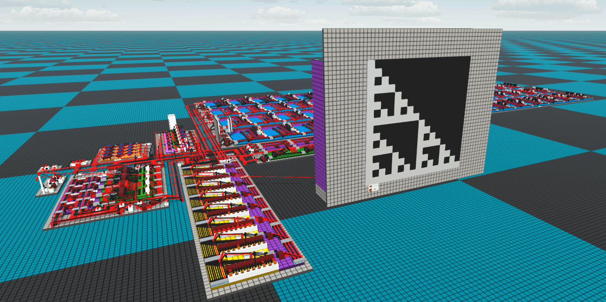

<!---
This file is used to generate your project datasheet. Please fill in the information below and delete any unused
sections.
You can also include images in this folder and reference them in the markdown. Each image must be less than
512 kb in size, and the combined size of all images must be less than 1 MB.
-->
## How it works

SR-Nibbler (formerly the SR-S4)

An extremely simple 4-bit CPU (with logically faithful Logic World visualisation - some minor implementation differences)
Called the SR-Nibbler because it only operates on nibbles.

Specs:
- 4x4b Register file
- 4B (8x4b) of DMEM (with some memory mapped features)
- Supports up to 64 IMEM instructions (IMEM hosted externally)
- Very minimal with only 8 supported instructions.

### Instruction Set

| Opcode | Instruction   | Operation                 | Description                                          |
|--------|---------------|---------------------------|------------------------------------------------------|
| 0      | NOP           | Does nothing              | No Operation                                         |
| 1      | ADD R1 R2 W   | W = R1 + R2               | Addition                                             |
| 2      | SUB R1 R2 W   | W = R1 - R2               | Subtraction                                          |
| 3      | LW R1 ADDR    | R1 = DMEM\[ADDR\]           | Load Word                                            |
| 4      | SW R1 ADDR    | DMEM\[ADDR\] = R1           | Store Word                                           |
| 5      | J ADDR        | IMEM -> ADDR              | Jump (sets entire PC)                                |
| 6      | BEZ R1 ADDR   | IMEM -> ADDR IF R1 == 0   | Branch if R1 equals zero (sets bottom 4 bits of PC)  |
| 7      | LI R1 VALUE   | R1 = VALUE                | Load Immediate                                       |

### Memory Structure

| Address | Description                                                              | Alias        |
|---------|--------------------------------------------------------------------------|--------------|
| 0       | Normal Nibble                                                            | N/A          |
| 1       | Normal Nibble                                                            | N/A          |
| 2       | Normal Nibble                                                            | N/A          |
| 3       | Normal Nibble (with fully observable output)                             | o_nibble_3   |
| 4       | Normal Nibble (with fully observable output)                             | o_nibble_4   |
| 5       | Normal Nibble (with fully observable output)                             | o_nibble_5   |
| 6       | Arithmetic right shift (saved value is arithmetic right shift of input)  | N/A          |
| 7       | Input Nibble                                                             | i_nibble_7   |

## How to test

To test you will need to setup the Raspberry Pi Pico with the required IMEM module.

## External hardware

The CPU requires an external IMEM module which can shift in the instruction word and accept a shifted out line address. 
I plan to implement this on the Raspberry Pi Pico. As for what to do with it that is up to anyone using it. 
You can simulate the design using the SystemVerilog implementation or you can view it on [Logic World](https://github.com/SRB2149/SR-Nibbler/tree/main/LogicWorld).
The memory mapped IO allows you to add external hardware like multipliers etc if these are required. You can even add a very small screen (with some interfacing) 
so you can draw things.

## Logic World Equivalent
